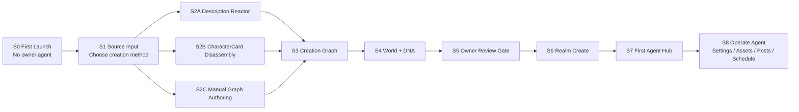

# Realm Agent Studio 产品 Storybook

> 用途：这份 Storybook 用于指导 Realm Agent Studio 的全面改版。它不是营销故事，也不是轻量 MVP 流程图，而是一套可被设计 AI、前端 AI、产品 AI、React Storybook 拆组件时直接引用的场景剧本。

## 0. Storybook 原则

Realm Agent Studio 的故事不是“用户填写一张创建表单”，而是“Owner 在一个工业级 Creation Cockpit 中，把来源材料转化成可审查、可写入、可运营的 Public Realm Agent”。

所有故事必须遵守：

- 只管理 owner-created public Realm Agents。
- 三种当前创建方式都必须被覆盖：描述生成、Downloaded CharacterCard 导入、手动高级创建。
- `existing-agent-remix` 只能作为 deferred future capability 出现。
- 3D 只负责空间理解、状态、拓扑和转场。
- 复杂字段、长文本、payload、source mapping、blocked/deferred ledger 必须在 Docked Workbench 中处理。
- 所有真实写入必须经过 Review Gate。
- AI 生成内容永远是 candidate。
- 不伪造 agent、不伪造 metric、不零填 `friendCount`。

## 1. 角色设定

### Owner

Realm Agent Studio 的直接用户。Owner 创建、审查、发布、维护自己的 public Realm Agent。Owner 不是内部平台管理员，也不是 world maintainer。

### Official Reference Agent

首次进入时用于教学的官方参考对象。它可以帮助用户理解创建完成后的 Agent Hub 形态，但它不是 owner-created agent，不进入 `/api/me/agents`，不产生 owner metric，不允许编辑和发布。

### Realm Agent

Owner 创建并由 Realm 返回 canonical object 后才成立的 public agent。它拥有公开 profile、world membership、DNA、可审查的 settings、identity candidates、post candidates。

### Runtime AI

提供 description seed、settings proposal、post copy proposal、image candidate、voice candidate 等能力。Runtime AI 只产出候选，不拥有 Realm truth。

### Review Gate

所有真实写入前的确认层。它不是确认弹窗，而是贯穿 Create、Settings、Assets、Posts、Schedule 的 persistent gate。

## 2. 总体叙事弧线

## 3. Chapter 01：第一次打开，无 Agent

### Story ID

`RAS-STORY-001-FIRST-LAUNCH-EMPTY-HUB`

### 场景目标

用户第一次注册或第一次打开 Studio，当前 owner portfolio 中没有任何 Agent。界面不能空白，也不能伪造用户数据。Hub 应自动转入 First Agent Creation Cockpit。

### 路由

`/portfolio`

### 画面结构

左侧 3D Spatial Overview：

- 一个 read-only Official Reference Agent silhouette。
- 一个空的 owner constellation。
- 一个发光的 Create portal。
- Source unavailable telemetry 明确展示为无 owner data，而不是 0。

右侧 Docked Workbench：

- 标题：`Create your first Realm Agent`
- Source Input 三入口：
  - Description。
  - Downloaded CharacterCard。
  - Manual。
- Existing Agent Remix 显示为 deferred locked item。
- 下方展示创建管线：
  - Source Input。
  - Creation Graph。
  - World。
  - DNA。
  - Owner Review。
  - Realm Create。

底部 Review Gate：

- 状态：`Waiting for source`
- 写入：无。
- blocked：`No source package selected`

### 用户动作

- 用户可以旋转 3D reference agent。
- 用户可以打开 reference agent 的 read-only profile preview。
- 用户选择三种创建方式之一。

### 数据规则

- 不请求或展示任何 fake `/api/me/agents` 数据。
- Official Reference Agent 必须标注 `read-only reference`。
- `friendCount` 不显示 0；如果需要展示指标区域，显示 `source unavailable`。

### 验收标准

- 空 portfolio 不呈现空表格。
- 官方参考 Agent 不进入 owner list。
- 用户一眼能理解“下一步是创建自己的 Agent”。

## 4. Chapter 02：选择创建方式

### Story ID

`RAS-STORY-002-SOURCE-METHOD-SWITCHER`

### 场景目标

用户决定用哪种来源构造 Agent。三种方式必须是同等重要的 Source Input，不是隐藏在表单中的小按钮。

### 路由

`/portfolio/create`

### 画面结构

中心 Source Method Switcher：

- Description Reactor：适合从自然语言概念开始。
- CharacterCard Import：适合从下载的角色卡开始。
- Manual Graph Authoring：适合高级用户直接定义结构。
- Existing Agent Remix：显示 `Deferred`，不可点击或点击后展示说明。

右侧 Method Preview：

- 当前方式会生成哪些 candidate。
- 哪些字段会进入 Creation Graph。
- 哪些字段不会直接写入 Realm。

底部 Review Gate：

- `Source method selected` 或 `Waiting for source method`。

### 用户动作

- 切换方法。
- 查看每个方法的能力和边界。
- 进入对应 Source Input。

### 验收标准

- 三种当前可用方式都能进入下一步。
- Existing Agent Remix 不能进入可执行流程。
- 切换方式会清空不适用的 source result，并使 graph acceptance 失效。

## 5. Chapter 03A：描述生成

### Story ID

`RAS-STORY-003A-DESCRIPTION-REACTOR`

### 场景目标

用户用一段自然语言描述构造 Agent seed。系统将描述变成候选字段，但不直接创建 Agent。

### 路由

`/portfolio/create`

### 画面结构

左侧 3D Spatial Overview：

- Source energy stream 从 prompt console 流向 Creation Graph core。
- 生成前 Graph core 是 dormant。
- 生成中显示 scanning / extracting 状态。

右侧 Docked Workbench：

- Prompt console。
- 示例提示，但不替代用户输入。
- Generate 按钮。
- Seed Extraction Preview：
  - handle。
  - displayName。
  - concept。
  - description。
  - ruleText。
  - dnaPrimary。
  - dnaSecondary。
  - reference image prompt。
- Runtime Rationale。
- Candidate badge：`AI-seeded candidate`。

底部 Review Gate：

- 生成前：`Source missing`
- 生成中：`Runtime generating candidate`
- 生成后：`Graph review required`

### 用户动作

- 输入描述。
- 触发生成。
- 查看生成字段。
- 修改字段。
- 进入 Creation Graph。

### 失败状态

- Runtime transport unavailable。
- Runtime route unbound。
- Runtime generation failed。
- Runtime output invalid。

### 验收标准

- AI 生成结果明确是 candidate。
- 修改任一关键字段后 graph fingerprint stale。
- 不允许生成后自动创建。

## 6. Chapter 03B：Downloaded CharacterCard 导入

### Story ID

`RAS-STORY-003B-CHARACTER-CARD-DISASSEMBLY`

### 场景目标

用户导入本地 CharacterCard JSON 或 PNG。系统本地解析来源，拆解字段，展示映射、候选、未知字段和风险。

### 路由

`/portfolio/create`

### 画面结构

左侧 3D Spatial Overview：

- 一个 card capsule 进入 scanner。
- scanner 输出多条 field beams 到 Creation Graph sections。
- unmapped / candidateOnly / blocked 字段用不同颜色标记。

右侧 Docked Workbench：

- File drop zone。
- Source Package Summary：
  - sourceName。
  - sourceFormat。
  - spec。
  - specVersion。
  - rawKeys。
  - dataKeys。
  - unknownDataKeys。
- Field Mapping Table：
  - name -> identity -> mapped。
  - description -> worldview -> mapped。
  - personality -> behavior -> candidateOnly。
  - scenario -> worldview -> candidateOnly。
  - first_mes -> greeting -> candidateOnly。
  - mes_example -> contentVoice -> candidateOnly。
  - alternate_greetings -> greeting -> candidateOnly。
  - creator_notes -> sourceProvenance -> unmapped。
  - system_prompt -> behavior -> candidateOnly。
  - post_history_instructions -> behavior -> candidateOnly。
  - character_book -> sourceProvenance -> unmapped。
  - extensions -> sourceProvenance -> unmapped。
  - unknown keys -> sourceProvenance -> unmapped。
- Risk Ledger：
  - system prompt 不直接写入。
  - unknown fields 不隐藏。
  - character book 不自动转为 Realm memory。

底部 Review Gate：

- 成功解析后：`Source parsed, graph review required`
- 解析失败：`Import blocked`

### 用户动作

- 上传 `.json` 或 `.png`。
- 查看解析结果。
- 查看每个字段如何映射。
- 修正 draft 字段。
- 进入 Creation Graph。

### 失败状态

- empty。
- oversized。
- unsupported file。
- JSON parse failed。
- JSON shape invalid。
- PNG invalid。
- PNG metadata missing。
- PNG metadata invalid。

### 验收标准

- 本地文件不默认上传。
- 成功 import 不等于成功 create。
- unknown / unmapped fields 必须可见。
- system_prompt 不可直接变成 public truth。

## 7. Chapter 03C：手动高级创建

### Story ID

`RAS-STORY-003C-MANUAL-GRAPH-AUTHORING`

### 场景目标

高级用户不需要 AI seed 或角色卡，直接创建 Source Package 和 Agent draft。Manual 是高级创作模式，不是简陋备用表单。

### 路由

`/portfolio/create`

### 画面结构

左侧 3D Spatial Overview：

- 空白 graph lattice。
- 用户填写字段时，sections 被点亮。
- missing decisions 以 warning nodes 呈现。

右侧 Docked Workbench：

- Identity：
  - handle。
  - displayName。
  - profile description。
- Worldview：
  - concept。
  - visible rules。
- DNA：
  - primary archetype。
  - secondary traits。
- World：
  - source-backed world selection。
- Visual reference：
  - referenceImageUrl。
  - optional reference prompt。

底部 Review Gate：

- 随字段补齐实时变化。

### 用户动作

- 跳过 seed。
- 手动填写字段。
- 触发 handle availability check。
- 选择 world。
- 选择 DNA。
- 进入 Graph review。

### 验收标准

- Manual 不绕过 Creation Graph。
- Manual 不绕过 handle availability。
- Manual 不绕过 source-backed world。
- Manual 不允许写 forbidden fields。

## 8. Chapter 04：Creation Graph 审查

### Story ID

`RAS-STORY-004-CREATION-GRAPH-REVIEW`

### 场景目标

用户看见来源如何被标准化为可创建的 Agent graph。Creation Graph 是核心对象，不是调试 JSON。

### 路由

`/portfolio/create`

### 画面结构

左侧 3D Spatial Overview：

- Graph core。
- Sections orbit：
  - identity。
  - dna。
  - behavior。
  - worldview。
  - greeting。
  - communicationVoice。
  - contentVoice。
  - visualBrief。
  - voiceBrief。
  - postBrief。
  - sourceProvenance。
  - missingDecisions。
  - riskNotes。
  - writePlan。

右侧 Docked Workbench：

- Section board。
- 每个 section 显示：
  - status。
  - summary。
  - fields。
  - missing。
  - risks。
  - ruleIds。
- Source fields table。
- Technical details 可折叠，不作为默认主视图。

底部 Review Gate：

- `Accept Creation Graph`
- `Graph accepted`
- `Graph stale`
- `Graph blocked`

### 用户动作

- 展开 section。
- 查看 source field mapping。
- 修改缺失字段。
- 接受 graph。

### 验收标准

- Required sections 缺失时不能进入 Realm Create。
- writePlan 中 `realm-create` blocked 时不能创建。
- Graph fingerprint stale 时必须重新 accept。

## 9. Chapter 05：World 与 DNA 调谐

### Story ID

`RAS-STORY-005-WORLD-DNA-TUNING`

### 场景目标

用户确认 Agent 属于哪个 World，以及 primary archetype / secondary traits 如何定义 Agent DNA。

### 路由

`/portfolio/create`

### 画面结构

左侧 3D Spatial Overview：

- World map。
- OASIS 或其他 source-backed worlds 作为 nodes。
- DNA core 在选中 world 后稳定成型。

右侧 Docked Workbench：

- World Selector：
  - id。
  - name。
  - type。
  - status。
  - contentRating。
  - tagline。
  - description。
  - overview。
  - themes。
  - agentCount。
  - nativeCreationState。
  - source。
- DNA Tuner：
  - primary archetype。
  - secondary traits。
  - trait explanation。
  - too many warning。

底部 Review Gate：

- `World missing`
- `World source unavailable`
- `DNA primary missing`
- `Ready for owner review`

### 用户动作

- 选择 World。
- 查看 World detail。
- 选择 primary DNA。
- 选择 secondary traits。

### 验收标准

- selected world 必须来自 source-backed selectable worlds。
- 没有 selectable worlds 时创建阻塞。
- DNA primary 必须存在。

## 10. Chapter 06：Owner Review Gate

### Story ID

`RAS-STORY-006-OWNER-REVIEW-GATE`

### 场景目标

用户在真实写入 Realm 前确认 source、candidate、payload、write plan 和风险。

### 路由

`/portfolio/create`

### 画面结构

底部或右侧 Persistent Review Gate：

- Readiness summary。
- Source package summary。
- Graph fingerprint status。
- Required fields。
- Handle availability。
- World source。
- DNA readiness。
- Write Plan Ledger：
  - realm-create。
  - owner-settings。
  - asset-candidate。
  - post-candidate。
  - blocked。
  - deferred。
- Payload preview。
- Create button。

### 用户动作

- 查看将要写入的 payload。
- 查看不会写入的字段。
- 接受 graph。
- 触发 Realm Create。

### 验收标准

- 未 accept graph 不能创建。
- handle 未检查或不可用不能创建。
- selected world 非 source-backed 不能创建。
- payload preview 不包含 forbidden fields。

## 11. Chapter 07：Realm Create 成功

### Story ID

`RAS-STORY-007-REALM-CREATE-SUCCESS`

### 场景目标

Realm 返回 canonical Agent 后，用户进入真实 Agent Hub。创建成功不等于所有后续 settings/assets/posts 都成功。

### 路由

从 `/portfolio/create` 转入：

- `/portfolio/:agentId`
- 或提供进入 `/portfolio/:agentId/settings` 的动作。

### 画面结构

左侧 3D Spatial Overview：

- Graph core collapse into Agent node。
- Agent node 被放入 selected World orbit。

右侧 Docked Workbench：

- Created Agent Card：
  - agentId。
  - handle。
  - displayName。
  - selectedWorldId。
  - state。
- Profile settings result：
  - updated。
  - already current。
  - failed。
  - not requested。
- Next actions：
  - Open Cockpit。
  - Open Settings。
  - Generate Identity Pack。
  - Draft First Post。

### 验收标准

- canonical id 来自 Realm create result。
- partial success 必须清楚展示。
- 创建成功后 invalidates owner portfolio query。

## 12. Chapter 08：Agent Cockpit

### Story ID

`RAS-STORY-008-AGENT-COCKPIT`

### 场景目标

用户进入单 Agent 运营中枢，理解当前 public profile、world、state、friendCount、下一步任务。

### 路由

`/portfolio/:agentId`

### 画面结构

左侧 3D Spatial Overview：

- Agent body / identity shell。
- World orbit。
- Telemetry ring。

右侧 Docked Workbench：

- Public Profile Snapshot：
  - displayName。
  - handle。
  - bio。
  - greeting。
  - world。
  - state。
  - avatarUrl。
  - profileCoverUrl。
- Metrics：
  - friendCount available。
  - 或 friendCount source unavailable。
- Action rail：
  - Settings。
  - Identity Studio。
  - Content Studio。
  - Local Schedule。

### 验收标准

- 不展示 LocalAgent memory/emotion。
- 不展示 fake analytics。
- source unavailable 是明确状态。

## 13. Chapter 09：Settings Workbench

### Story ID

`RAS-STORY-009-SETTINGS-WORKBENCH`

### 场景目标

用户编辑 public profile、personality、communication、boundaries、positioning。Runtime proposal 只能作为候选，真实 settings update 通过 Review Gate。

### 路由

`/portfolio/:agentId/settings`

### 画面结构

左侧 3D Spatial Overview：

- Agent shell 的 profile layers。
- 修改中的 sections 发光。
- blocked forbidden fields 显示为 red shield。

右侧 Docked Workbench：

- Public Identity：
  - displayName。
  - description。
  - greeting。
- Personality：
  - publicRole。
  - worldview。
  - personalitySummary。
  - relationshipMode。
  - interestsText。
  - goalsText。
- Communication：
  - contentStyle。
  - formality。
  - responseLength。
  - sentiment。
- Boundaries：
  - allowedThemesText。
  - disallowedThemesText。
- Positioning：
  - targetAudience。
  - positioning。
- Runtime Proposal Candidate。
- Forbidden Field Ledger。

底部 Review Gate：

- owner settings payload。
- no changes。
- raw rule review deferred。
- update owner settings。

### 验收标准

- 禁止字段不能进入 payload。
- rawRuleTextCandidate 不能静默写入。
- Runtime proposal 不能自动保存。

## 14. Chapter 10：Identity Studio

### Story ID

`RAS-STORY-010-IDENTITY-STUDIO`

### 场景目标

用户生成和审查 identity pack、visual candidates、avatar package、voice demo。大部分资产是 candidate，public write 边界必须显式展示。

### 路由

`/portfolio/:agentId/assets`

### 画面结构

左侧 3D Spatial Overview：

- Agent identity shell。
- Avatar / portrait / voice / post-image-style slots。
- blocked public writes 显示为 locked connectors。

右侧 Docked Workbench：

- Identity Pack：
  - avatar。
  - profile-cover。
  - portrait-reference。
  - post-image-style。
  - voice-demo。
- Visual Candidate Generator：
  - resourceType。
  - bindingPoint。
  - prompt。
  - notes。
  - aspectRatio。
- Avatar Package：
  - packageTarget。
  - motionNotes。
  - interactionNotes。
- Voice Demo：
  - scriptText。
- Public Write Ledger：
  - avatar URL selection admitted after owner URL review。
  - profile cover publication blocked。
  - resource-agent binding blocked。
  - voice publication blocked。
  - post attachment candidate only。

### 验收标准

- blocked reason 必须展示。
- voice demo 不等于 public voice publication。
- generated image missing artifact 时 fail closed。

## 15. Chapter 11：Content Studio

### Story ID

`RAS-STORY-011-CONTENT-STUDIO`

### 场景目标

用户为 Agent 生成、审查、发布 post candidate。Runtime post proposal 只是 copy candidate。

### 路由

`/portfolio/:agentId/posts`

### 画面结构

左侧 3D Spatial Overview：

- Agent voice channel。
- Draft capsule。
- Publish gate。

右侧 Docked Workbench：

- Post Draft：
  - caption。
  - tagsText。
  - humanReviewed。
  - attachmentEnabled。
  - attachmentTargetType。
  - attachmentTargetId。
- Attachment Candidate。
- Runtime Copy Proposal。
- Forbidden Post Field Ledger。
- Publish payload preview。

底部 Review Gate：

- draft missing。
- human review missing。
- attachment invalid。
- ready to publish。
- publish success only after canonical post returned。

### 验收标准

- 不允许 provider/model/localAgent/schedule/queue/campaign 字段进入 post payload。
- humanReviewed 必须控制 publish readiness。
- publish success 只能来自 canonical post object。

## 16. Chapter 12：Local Schedule Gate

### Story ID

`RAS-STORY-012-LOCAL-SCHEDULE-GATE`

### 场景目标

用户为已经 reviewed 的 local post draft 设置单个本地 schedule candidate。界面必须明确这不是 Realm queue。

### 路由

`/portfolio/:agentId/posts/schedule`

### 画面结构

左侧 3D Spatial Overview：

- local clock ring。
- single pending capsule。
- foreground required indicator。

右侧 Docked Workbench：

- localDate。
- localTime。
- localRunAt。
- appLocalOnly。
- foreground-when-due。
- pending-owner-app-open。
- current scheduled candidate。

底部 Review Gate：

- local run date/time missing。
- local run time must be in future。
- reviewed publishable local post draft required。
- schedule candidate ready。

### 验收标准

- 只能单个本地 schedule。
- 不能显示 campaign、recurrence、queue。
- 不能声称 Realm schedule success。

## 17. Chapter 13：有多个 Agent 的 Portfolio Hub

### Story ID

`RAS-STORY-013-PORTFOLIO-CONSTELLATION`

### 场景目标

用户已有多个 owner-created agents，Hub 以 constellation 方式展示全局状态，同时保留高密度 list controls。

### 路由

`/portfolio`

### 画面结构

左侧 3D Spatial Overview：

- 每个 owner-created agent 是一个 node。
- worldName 形成分组或 orbit。
- `friendCount` available 影响真实 telemetry。
- `friendCount` source-unavailable 显示 disconnected telemetry。

右侧 Docked Workbench：

- Search。
- Filter：
  - all。
  - friend-count-available。
  - friend-count-unavailable。
- Sort：
  - realm-order。
  - display-name-asc。
  - updated-desc。
  - friend-count-desc。
  - friend-count-asc。
- Agent list rows。
- Selected Agent Preview。

### 验收标准

- 所有 list items 来自 owner portfolio source。
- `friendCount` source unavailable 不显示为 0。
- 不出现 creator/world/system/dev agent。

## 18. Chapter 14：失败与阻塞故事

### Story ID

`RAS-STORY-014-FAIL-CLOSED-STATES`

### 场景目标

产品必须把失败当成一等状态。失败不能被隐藏成 loading、空值或默认值。

### 必须有故事的失败状态

- Realm unavailable。
- Permission missing。
- Owner authority missing。
- Setting read unavailable。
- Runtime transport unavailable。
- Runtime route unbound。
- Runtime invalid output。
- Handle availability failed。
- Handle unavailable。
- World selection unavailable。
- No selectable worlds。
- Selected world unavailable。
- CharacterCard parse failures。
- Graph stale。
- Graph blocked。
- Payload invalid。
- Post publish failed。
- Local schedule invalid。

### 画面要求

- 每个失败状态都有 typed label。
- 每个失败状态都有用户可理解的 next action。
- 每个失败状态都不制造 pseudo success。

## 19. React Storybook 组件矩阵

以下 stories 可作为后续 `.stories.tsx` 的拆分蓝图。

### 19.1 Hub Stories

- `AgentHub.EmptyFirstRun`
- `AgentHub.EmptyWithReferenceAgent`
- `AgentHub.PortfolioLoaded`
- `AgentHub.FriendCountUnavailable`
- `AgentHub.RealmUnavailable`
- `AgentHub.PermissionMissing`

### 19.2 Source Input Stories

- `SourceMethodSwitcher.Default`
- `SourceMethodSwitcher.DescriptionSelected`
- `SourceMethodSwitcher.CharacterCardSelected`
- `SourceMethodSwitcher.ManualSelected`
- `SourceMethodSwitcher.ExistingRemixDeferred`

### 19.3 Description Reactor Stories

- `DescriptionReactor.Empty`
- `DescriptionReactor.ReadyToGenerate`
- `DescriptionReactor.Generating`
- `DescriptionReactor.GeneratedCandidate`
- `DescriptionReactor.RuntimeUnavailable`
- `DescriptionReactor.InvalidOutput`

### 19.4 CharacterCard Stories

- `CharacterCardDisassembly.Empty`
- `CharacterCardDisassembly.JsonParsed`
- `CharacterCardDisassembly.PngParsed`
- `CharacterCardDisassembly.UnknownFields`
- `CharacterCardDisassembly.SystemPromptCandidateOnly`
- `CharacterCardDisassembly.MetadataMissing`
- `CharacterCardDisassembly.Oversized`
- `CharacterCardDisassembly.InvalidJson`

### 19.5 Manual Authoring Stories

- `ManualGraphAuthoring.Empty`
- `ManualGraphAuthoring.Partial`
- `ManualGraphAuthoring.Ready`
- `ManualGraphAuthoring.MissingDna`
- `ManualGraphAuthoring.MissingWorld`

### 19.6 Creation Graph Stories

- `CreationGraphBoard.Ready`
- `CreationGraphBoard.NeedsDecision`
- `CreationGraphBoard.Blocked`
- `CreationGraphBoard.StaleFingerprint`
- `CreationGraphBoard.Accepted`
- `CreationGraphBoard.CharacterCardMapping`

### 19.7 World / DNA Stories

- `WorldSelectorMap.OasisDefault`
- `WorldSelectorMap.NoSelectableWorlds`
- `WorldSelectorMap.SelectedUnavailable`
- `DnaTuner.Empty`
- `DnaTuner.PrimarySelected`
- `DnaTuner.TooManySecondaryTraits`

### 19.8 Review Gate Stories

- `ReviewGate.WaitingForSource`
- `ReviewGate.GraphReviewRequired`
- `ReviewGate.GraphAccepted`
- `ReviewGate.HandleUnavailable`
- `ReviewGate.WorldBlocked`
- `ReviewGate.ReadyToCreate`
- `ReviewGate.Creating`
- `ReviewGate.Created`
- `ReviewGate.PartialSuccess`

### 19.9 Agent Cockpit Stories

- `AgentCockpit.Loaded`
- `AgentCockpit.FriendCountAvailable`
- `AgentCockpit.FriendCountSourceUnavailable`
- `AgentCockpit.SettingReadUnavailable`
- `AgentCockpit.ActionRail`

### 19.10 Settings Stories

- `SettingsWorkbench.Loaded`
- `SettingsWorkbench.RuntimeProposalCandidate`
- `SettingsWorkbench.ForbiddenFieldsBlocked`
- `SettingsWorkbench.NoChanges`
- `SettingsWorkbench.RawRuleDeferred`
- `SettingsWorkbench.UpdateReady`

### 19.11 Identity Studio Stories

- `IdentityStudio.Empty`
- `IdentityStudio.IdentityPackCandidate`
- `IdentityStudio.VisualCandidateGenerated`
- `IdentityStudio.AvatarUrlSelectionReady`
- `IdentityStudio.ProfileCoverBlocked`
- `IdentityStudio.VoicePublicationBlocked`
- `IdentityStudio.RuntimeImageMissingArtifact`

### 19.12 Content / Schedule Stories

- `ContentStudio.EmptyDraft`
- `ContentStudio.RuntimeCopyCandidate`
- `ContentStudio.HumanReviewMissing`
- `ContentStudio.ReadyToPublish`
- `ContentStudio.PublishFailed`
- `LocalScheduleGate.NoReviewedDraft`
- `LocalScheduleGate.TimeInPast`
- `LocalScheduleGate.Ready`
- `LocalScheduleGate.PendingOwnerAppOpen`

## 20. 关键屏幕文案骨架

### First-run Hub

- Title: `Create your first Realm Agent`
- Subtitle: `Start from a description, a downloaded CharacterCard, or a manual creation graph.`
- Reference badge: `Official reference · read-only`
- Gate status: `No owner agent exists yet`

### Description Reactor

- Title: `Describe the agent you want to create`
- Action: `Generate candidate graph`
- Candidate label: `AI-seeded candidate`
- Warning: `Generated fields require owner review before Realm create.`

### CharacterCard Disassembly

- Title: `Import a downloaded CharacterCard`
- Badge: `Local file`
- Action: `Inspect source mapping`
- Warning: `Imported fields are source evidence, not Realm truth.`

### Manual Graph Authoring

- Title: `Author the creation graph manually`
- Action: `Start manual graph`
- Warning: `Manual creation still requires source-backed world, handle check, DNA, and graph review.`

### Review Gate

- Title: `Owner Review Gate`
- Ready: `Ready for Realm Create`
- Blocked: `Creation blocked`
- Stale: `Graph changed after review`
- Action: `Create Realm Agent`

## 21. 完整验收清单

- First-run 没有真实 Agent 时，Hub 不空白、不伪造数据。
- 三种创建方式都在首屏清晰可选。
- CharacterCard JSON/PNG 导入有完整 parsing、mapping、failure、unknown field story。
- Manual 创建不是低级表单，而是高级 graph authoring。
- Creation Graph 是核心审查界面。
- World 和 DNA 不是孤立字段，而是 creation readiness 的关键门。
- Review Gate 对所有真实写入一视同仁。
- Existing Agent Remix 只展示 deferred。
- `friendCount` 缺来源时显示 source unavailable。
- Runtime AI 只生成 candidate。
- 不展示 LocalAgent private memory/emotion。
- 不出现 creator/world/system/dev agent 管理入口。
- 不把 local schedule 说成 Realm queue。
- 所有失败状态 fail closed。
